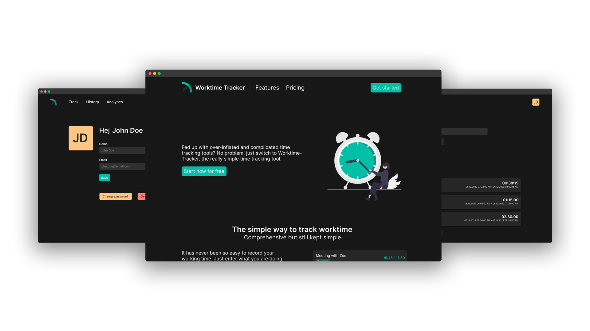

    

# WorkTime Tracker

> ℹ️ **Note**: This repository contains the source code and documentation of the practice project which we created in addition to our final exam. The project is not production ready and is still in development.

WorkTime Tracker is a web application that allows you to track your working hours. You can create projects and assign them to your tracked times. 

For the reason that we want that a user can have a track about his/hers tracked times, we implemented a backend where the tracked times are stored and secured using user authentification.

## 🔨 Development Stuff

### Tech Stack
- ⭐️ [Next.js](https://nextjs.org/) for the frontend and user backend
- ⭐️ [TailwindCSS](https://tailwindcss.com/) for styling
- ⭐️ [Recoil](https://recoiljs.org/) for user state handling
- ⭐️ [Appwrite](https://appwrite.io) as backend for user and userdata handling and storing

### Local Development
To develop locally on this project you need to follow the next steps

#### **Requipments**
> ℹ️ **Note**: On mac you can use Homebrew to install the requipments
- [Git](https://git-scm.com/)
- [Node](https://nodejs.org/) & [NPM](https://www.npmjs.com/)

#### **Project**
1. clone the repository using git
2. open code project in your IDE `%DIR%/worktime-tracker-dev` 
3. rename `next.config.js.example` to `next.config.js`
4. change the variables in `env` and `images` block in the `next.config.js` file
5. run `npm i` in your terminal
6. run `npm run dev` to start the dev server

##### **Appwrite Backend**
To use this project, you need a running appwrite instance.
*Currently we are working on a tutorial/documentation how to setup the project, databases, etc.*

## 💬 FAQ
#### **Is this production ready?**
In the current state this SaaS should only used locally. We are working hard to develop a stable release so that you can also run it as service outside you local network.

#### **Can I help fixing issues or develop new features?**
Yes of course! You can always help us improve this code to always provide new features and optimized builds. To start search for an existing issue/feature request or create one and ask if you can do this task. After finish developing, you can create a Pull-Request from you fork where we want to review your work.

## ❤️ Credits
Created with much ❤️, 🧠 and 😁 by
- [Danny Schapeit](https://github.com/d3nn7)
- [Jonas Bott](https://github.com/Jonas22rr)

---
Worktime Tracker is a project mainly developed by [**Danny Schapeit**](https://github.com/d3nn7) and [**Jonas Bott**](https://github.com/Jonas22rr) as part of a school project. The project is licensed under [MIT](./LICENSE).