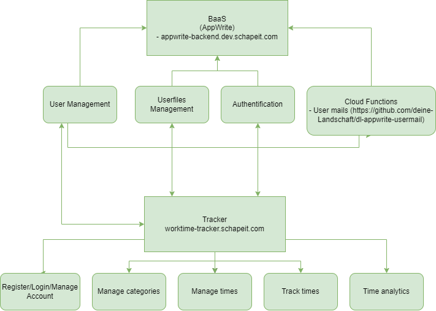

# Practise-Project - WorkTime Tracker
In this repository is the source code and documentation of the practice project which we created in addition to our final exam.

Authors
- [Danny Schapeit](https://github.com/d3nn7)
- [Jonas Bott](https://github.com/Jonas22rr)

## [Documentation](./documentation/) (only in german)
- [Projektantrag](./documentation/Projektantrag.md)